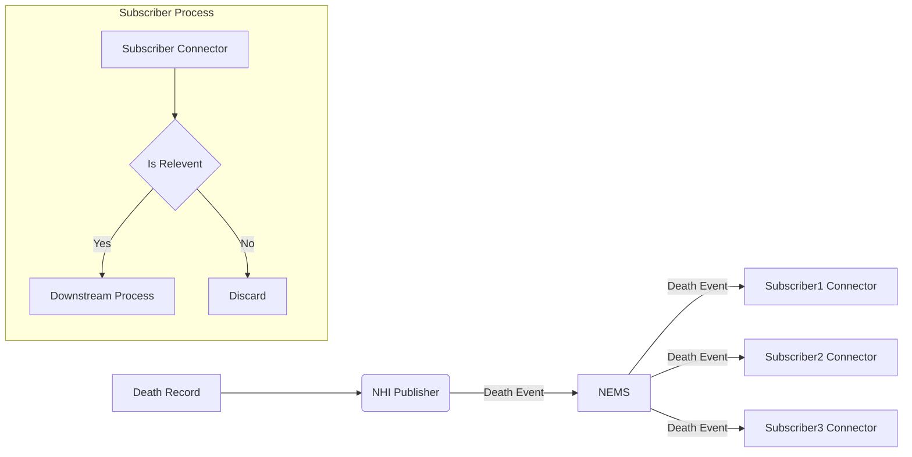
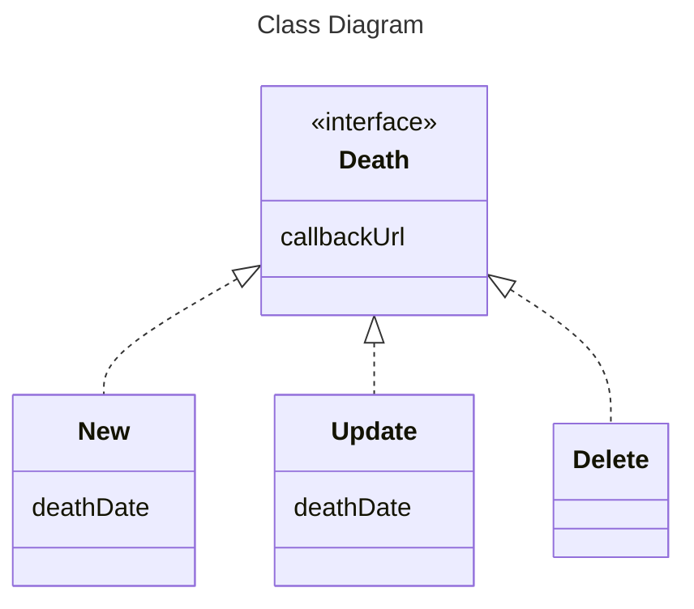

---
title: "Death Event Technical Design"
---

This a technical design document for NEMS death event. The target audiences are those working on death event publisher applications, death event subscriber applications, and NEMS implementation of death events.

## **Background**

The NHI system process and record the patient information, including death. Death information is of interest to various stakeholders in the health sector, including patient administration systems (PAS), assisted dying service (ADS) and others.

## **Process view**

Death event process view:

Death events and event data:

## **Topic taxonomy**

For death events, the topic taxonomy structure follows the overall topic taxonomy structure:

service-domain/resource/event/verb/version/event-properties

The topic fields are elaborated in the table below 

|**Enrolment Event Topic Field**|**Field Type**|**Value**|**Description**|
| :-: | :-: | :-: | :-: |
|service-domain|Root|“demographics”|Healthcare service domain|
|resource|Root|“patient”|Aligned with FHIR EpisodeOfCare resource|
|event category|Root|“death”|Event category|
|verb|Root|Variable: new, edit, delete|Event action, one of the values|
|version|Root|“0.1.0”|Starting version|
|District|Event Property|8 character code or "null" (lowercase)|Location of the district relating to the person’s primary residential address. [Code Tables](https://www.tewhatuora.govt.nz/our-health-system/data-and-statistics/nz-health-statistics/data-references/code-tables/)|
|Domicile|Event Property|4 character district code or "null" (lowercase)| Domicile code, representing a person’s primary residential address. [Domicile Codes](https://fhir.org.nz/ig/base/CodeSystem-domicile-code.html) |
|GP Practice|Event Property|8 character code or "null" (lowercase)|The active GP practice of the deceased healthcare user. [Facility Codes](https://www.tewhatuora.govt.nz/our-health-system/data-and-statistics/nz-health-statistics/data-references/code-tables/common-code-tables#facility-code-table) **Note**: Not all healthcare users have a GP practice. Where no GP practice exists for the NHI, this field will be "**null**"|

## **Message header (Event metadata)**

|**Header**|**Key Literal**|**Description**|**Required**|**Format/Values**|**Example**|
| :-: | :-: | :-: | :-: | :-: | :-: |
|ID|solace-user-property-id|Message id, unique for each publisher|Required|GUID correlation ID|987298dd-c484-462f-a15d-f18a97267959|
|Source|solace-user-property-source|publisher URI reference|Required|[https://hip-uat.digital.health.nz](https://hip-uat.digital.health.nz/) for UAT [https://hip.digital.health.nz](https://hip.digital.health.nz/)  for prod| [https://hip-uat.digital.health.nz](https://hip-uat.digital.health.nz/) for UAT and [https://hip.digital.health.nz](https://hip.digital.health.nz/)  for prod|
|Time|solace-user-property-time|UTC time when the message is published|Required|YYYY-MM-DDTHH:MM:SS|2023-11-30T18:54:43Z|
|Spec Version|version|version of the CloudEvents spec|Optional|major.minor|1.0|
|Type|solace-user-property-type|substring of the topic taxonomy including root to version|Required|\{root\}/\{version\}|demographics/patient/death/new/v1.0.0|
|Subject|solace-user-property-subject|NHI number|Required|[A-Z]\{3\}([0-9]\{4\}\|([0-9]\{2\}[A-Z]\{2\}))|ZZZ0008 ZXE24NV|
|Content type|solace-user-property-datacontenttype or content-type for REST API|Content type of event data|Required|application/json|application/jso|

## Message payload

## Event : death/new

### Payload Schema

~~~JSON

{
  "$schema": "https://json-schema.org/draft/2019-09/schema",
  "type": "object",
  "properties": {
    "callbackUrl": {
      "type": "string",
      "description": "Call back url for deseased patient record",     
    },
    "deathDate": {
      "type": "string",
      "description": "Death date following the FHIR primitive date data type definition. This can be date or partial date.",
      "pattern": "^([0-9]([0-9]([0-9][1-9]|[1-9]0)|[1-9]00)|[1-9]000)(-(0[1-9]|1[0-2])(-(0[1-9]|[1-2][0-9]|3[0-1]))?)?$",
  }
  },
  "additionalProperties": false,
  "required": [
    "callbackUrl",
    "deathDate",
  ]
}

~~~

### Example

~~~JSON

{
  "$schema": "https://json-schema.org/draft/2019-09/schema",
  "type": "object",
  "properties": {
    "callbackUrl": {
      "type": "string",
      "description": "Call back url for deceased patient record",     
    },
    "deathDate": {
      "type": "string",
      "description": "Death date following the FHIR primitive date data type definition. This can be date or partial date.",
      "pattern": "^([0-9]([0-9]([0-9][1-9]|[1-9]0)|[1-9]00)|[1-9]000)(-(0[1-9]|1[0-2])(-(0[1-9]|[1-2][0-9]|3[0-1]))?)?$",
  }
  },
  "additionalProperties": false,
  "required": [
    "callbackUrl",
    "deathDate",
  ]
},
{
 "callbackUrl": "https://api.hip-uat.digital.health.nz/fhir/nhi/v1/Patient/ZGT56KB",
 "deathDate": "2023-11",
}

~~~

## Event : death/update

### Payload Schema

As Above

### Example

As Above

## Event : death/delete

**Payload Schema**

~~~JSON

{
 "$schema": "https://json-schema.org/draft/2019-09/schema",
 "type": "object",
 "properties": {
 "callbackUrl": {
 "type": "string",
 "description": "Call back url for deseased patient record", 
},
 },
 "additionalProperties": false,
 "required": [
 "callbackUrl",
 ]
}

~~~

**Example**

~~~text

TBD

~~~
