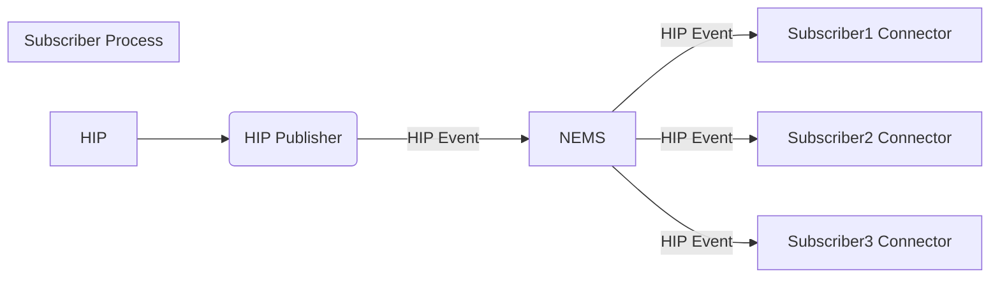
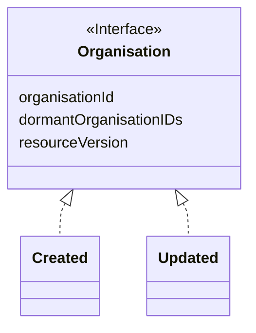

 
This a technical design document for the HPI Organisation NEMS event. The target audiences are those working on enrolment publisher application, enrolment subscriber applications, and NEMS implementation of HPI events. 

# **Background**
Te Whatu Ora Health Identity Team maintains a register of organisation that operate facilities delivering health services, in the Health Provider Index system (HPI). 

Organisations are based on legal entities e.g. Company, Charitable Trust, non-registered partnership or Sole Trader.

When changes to Organisations are made with regards to their status and facilities, this information is required by Te Whatu Ora, Accident Compensation Corporation and other organisations for a number of functions including management of contracts, payments and API credentialing. 

The HPI Organisation NEMS event will enable subscription to HPI Organisation changes in real-time.

# **Process view**
Event process view:

 
Organisation events and event data:

# **Topic taxonomy**
For  events, the topic taxonomy structure follows the overall topic taxonomy structure:

service-domain/resource/event/verb/version/type

The topic fields are elaborated in the table below (with Dark-green for root taxonomy; Light-green for event property)

|**Event Topic Field**|**Field Type**|**Value**|**Description**|
| :-: | :-: | :-: | :-: |
|service-domain|Root|“provideridentity”|“provider identity” is the service domain of organisation events|
|resource|Root|“organisation”|The Organisation resource represents any organisation that provides healthcare services.|
|event category|Root|“organisation”|The Organisation resource represents any organisation that provides healthcare services.|
|verb|Root|created, updated|Event action, one of the values|
|version|Root|“v1”|Starting version|
|type|Event Property|3 Digit Code|[https://common-ig.hip.digital.health.nz/site/ValueSet-hpi-organisation-type-1.2.html#expansion|

# **Organisation Type Codes**

|**Code**|**Display**|**Definition**|
| :-: | :-: | :-: | 
|[001](https://aus01.safelinks.protection.outlook.com/?url=https%3A%2F%2Fcommon-ig.hip.digital.health.nz%2Fsite%2FCodeSystem-hpi-organisation-type-1.2.html%23hpi-organisation-type-1.2-001&data=05%7C02%7COwen.Thomas%40TeWhatuOra.govt.nz%7C5491e799e6cd40be8d0f08dd96502468%7Cbed4da513cdb4d0dbaf8fb80d53268e3%7C0%7C0%7C638831993134106781%7CUnknown%7CTWFpbGZsb3d8eyJFbXB0eU1hcGkiOnRydWUsIlYiOiIwLjAuMDAwMCIsIlAiOiJXaW4zMiIsIkFOIjoiTWFpbCIsIldUIjoyfQ%3D%3D%7C0%7C%7C%7C&sdata=hfjfjeM4IVC1V%2Fv4doAUwiyv60JnLPJsfyud5TVw%2Bzw%3D&reserved=0)|District Health Board (DHB)|DHBs provide (or fund the provision of) health and disability services to 20 districts throughout New Zealand.|
|[003](https://aus01.safelinks.protection.outlook.com/?url=https%3A%2F%2Fcommon-ig.hip.digital.health.nz%2Fsite%2FCodeSystem-hpi-organisation-type-1.2.html%23hpi-organisation-type-1.2-003&data=05%7C02%7COwen.Thomas%40TeWhatuOra.govt.nz%7C5491e799e6cd40be8d0f08dd96502468%7Cbed4da513cdb4d0dbaf8fb80d53268e3%7C0%7C0%7C638831993134121293%7CUnknown%7CTWFpbGZsb3d8eyJFbXB0eU1hcGkiOnRydWUsIlYiOiIwLjAuMDAwMCIsIlAiOiJXaW4zMiIsIkFOIjoiTWFpbCIsIldUIjoyfQ%3D%3D%7C0%7C%7C%7C&sdata=Z6w4RXxOqimVNdcwR2RKF8g1CnDXNRPu%2FDGtk6y6MOM%3D&reserved=0)|Government Organisations|This includes both national and local government bodies but excludes DHBs.|
|[006](https://aus01.safelinks.protection.outlook.com/?url=https%3A%2F%2Fcommon-ig.hip.digital.health.nz%2Fsite%2FCodeSystem-hpi-organisation-type-1.2.html%23hpi-organisation-type-1.2-006&data=05%7C02%7COwen.Thomas%40TeWhatuOra.govt.nz%7C5491e799e6cd40be8d0f08dd96502468%7Cbed4da513cdb4d0dbaf8fb80d53268e3%7C0%7C0%7C638831993134134278%7CUnknown%7CTWFpbGZsb3d8eyJFbXB0eU1hcGkiOnRydWUsIlYiOiIwLjAuMDAwMCIsIlAiOiJXaW4zMiIsIkFOIjoiTWFpbCIsIldUIjoyfQ%3D%3D%7C0%7C%7C%7C&sdata=94JUDmXFnhZC9hWaqimjdjq77t%2FSZp7mpoFd6w3YDr8%3D&reserved=0)|Responsible Authority|Responsible Authorities are Listed in the Health Practitioners Competency Assurance Act 2003.|
|[007](https://aus01.safelinks.protection.outlook.com/?url=https%3A%2F%2Fcommon-ig.hip.digital.health.nz%2Fsite%2FCodeSystem-hpi-organisation-type-1.2.html%23hpi-organisation-type-1.2-007&data=05%7C02%7COwen.Thomas%40TeWhatuOra.govt.nz%7C5491e799e6cd40be8d0f08dd96502468%7Cbed4da513cdb4d0dbaf8fb80d53268e3%7C0%7C0%7C638831993134146857%7CUnknown%7CTWFpbGZsb3d8eyJFbXB0eU1hcGkiOnRydWUsIlYiOiIwLjAuMDAwMCIsIlAiOiJXaW4zMiIsIkFOIjoiTWFpbCIsIldUIjoyfQ%3D%3D%7C0%7C%7C%7C&sdata=DOO2noZPulpJcon1z4iWZr1JoDOqaSKZDWFDT%2FR6h3w%3D&reserved=0)|Research Institutions|Research institutions not involved in education.|
|[008](https://aus01.safelinks.protection.outlook.com/?url=https%3A%2F%2Fcommon-ig.hip.digital.health.nz%2Fsite%2FCodeSystem-hpi-organisation-type-1.2.html%23hpi-organisation-type-1.2-008&data=05%7C02%7COwen.Thomas%40TeWhatuOra.govt.nz%7C5491e799e6cd40be8d0f08dd96502468%7Cbed4da513cdb4d0dbaf8fb80d53268e3%7C0%7C0%7C638831993134159456%7CUnknown%7CTWFpbGZsb3d8eyJFbXB0eU1hcGkiOnRydWUsIlYiOiIwLjAuMDAwMCIsIlAiOiJXaW4zMiIsIkFOIjoiTWFpbCIsIldUIjoyfQ%3D%3D%7C0%7C%7C%7C&sdata=ekL5iKZKcpq49qoIIUtgPbX0AknJPkkB77j%2BhuoSTl8%3D&reserved=0)|Education Institutions|Education institutions - these may include those involved in research, e.g. universities.|
|[009](https://aus01.safelinks.protection.outlook.com/?url=https%3A%2F%2Fcommon-ig.hip.digital.health.nz%2Fsite%2FCodeSystem-hpi-organisation-type-1.2.html%23hpi-organisation-type-1.2-009&data=05%7C02%7COwen.Thomas%40TeWhatuOra.govt.nz%7C5491e799e6cd40be8d0f08dd96502468%7Cbed4da513cdb4d0dbaf8fb80d53268e3%7C0%7C0%7C638831993134171905%7CUnknown%7CTWFpbGZsb3d8eyJFbXB0eU1hcGkiOnRydWUsIlYiOiIwLjAuMDAwMCIsIlAiOiJXaW4zMiIsIkFOIjoiTWFpbCIsIldUIjoyfQ%3D%3D%7C0%7C%7C%7C&sdata=QZ3yqHL8IxN%2FdFNvcYfFxKaXDD4IIE1YHRxymPsVYJU%3D&reserved=0)|Primary Health Organisation (PHO)|PHOs are the local provider organisations through which DHBs implement the Primary Health Care Strategy.|
|[027](https://aus01.safelinks.protection.outlook.com/?url=https%3A%2F%2Fcommon-ig.hip.digital.health.nz%2Fsite%2FCodeSystem-hpi-organisation-type-1.2.html%23hpi-organisation-type-1.2-027&data=05%7C02%7COwen.Thomas%40TeWhatuOra.govt.nz%7C5491e799e6cd40be8d0f08dd96502468%7Cbed4da513cdb4d0dbaf8fb80d53268e3%7C0%7C0%7C638831993134184557%7CUnknown%7CTWFpbGZsb3d8eyJFbXB0eU1hcGkiOnRydWUsIlYiOiIwLjAuMDAwMCIsIlAiOiJXaW4zMiIsIkFOIjoiTWFpbCIsIldUIjoyfQ%3D%3D%7C0%7C%7C%7C&sdata=m%2FXGuNrNHrcRujE2si%2FcMtJH3t7%2BImJ7O3C1Oa%2BJCMI%3D&reserved=0)|Māori Health Provider|Provider organisations that are owned and governed by Māori and provide services primarily, but not exclusively, to Māori.|
|[028](https://aus01.safelinks.protection.outlook.com/?url=https%3A%2F%2Fcommon-ig.hip.digital.health.nz%2Fsite%2FCodeSystem-hpi-organisation-type-1.2.html%23hpi-organisation-type-1.2-028&data=05%7C02%7COwen.Thomas%40TeWhatuOra.govt.nz%7C5491e799e6cd40be8d0f08dd96502468%7Cbed4da513cdb4d0dbaf8fb80d53268e3%7C0%7C0%7C638831993134198067%7CUnknown%7CTWFpbGZsb3d8eyJFbXB0eU1hcGkiOnRydWUsIlYiOiIwLjAuMDAwMCIsIlAiOiJXaW4zMiIsIkFOIjoiTWFpbCIsIldUIjoyfQ%3D%3D%7C0%7C%7C%7C&sdata=xkGW7vgznD3nV9f%2FF9wiKRJKcGiYuf5Gm3XDyh75OxE%3D&reserved=0)|Pacific Health Provider|Provider organizations that are owned and governed by Pacific people, and provides services primarily but not exclusively for Pacific people.|
|[999](https://aus01.safelinks.protection.outlook.com/?url=https%3A%2F%2Fcommon-ig.hip.digital.health.nz%2Fsite%2FCodeSystem-hpi-organisation-type-1.2.html%23hpi-organisation-type-1.2-999&data=05%7C02%7COwen.Thomas%40TeWhatuOra.govt.nz%7C5491e799e6cd40be8d0f08dd96502468%7Cbed4da513cdb4d0dbaf8fb80d53268e3%7C0%7C0%7C638831993134210580%7CUnknown%7CTWFpbGZsb3d8eyJFbXB0eU1hcGkiOnRydWUsIlYiOiIwLjAuMDAwMCIsIlAiOiJXaW4zMiIsIkFOIjoiTWFpbCIsIldUIjoyfQ%3D%3D%7C0%7C%7C%7C&sdata=RgcfLXj6D8%2FK6IWrfKkeHNL6Io%2FFxvBuvuDZ1g45BoI%3D&reserved=0)|Other||

# **Message header (Event metadata)**

|**Header**|**Key Literal**|**Description**|**Required**|**Format/Values**|**Example**|
| :-: | :-: | :-: | :-: | :-: | :-: |
|ID|solace-user-property-id|Message id, unique for each publisher|Required|GUID correlation ID|987298dd-c484-462f-a15d-f18a97267959|
|Source|solace-user-property-source|publisher URI reference|Required|[https://hip-uat.digital.health.nz](https://hip-uat.digital.health.nz/) for UAT [https://hip.digital.health.nz](https://hip.digital.health.nz/)  for prod| [https://hip-uat.digital.health.nz](https://hip-uat.digital.health.nz/) for UAT and [https://hip.digital.health.nz](https://hip.digital.health.nz/)  for prod|
|Time|solace-user-property-time|UTC time when the message is published|Required|YYYY-MM-DDTHH:MM:SS|2023-11-30T18:54:43Z|
|Spec Version|version|version of the CloudEvents spec|Optional|major.minor|1.0|
|Type|solace-user-property-type|substring of the topic taxonomy including root to version|Required|\{root\}/\{version\}|demographics/patient/death/new/v1.0.0|
|Subject|solace-user-property-subject|NHI number|Required|[A-Z]\{3\}([0-9]\{4\}|([0-9]\{2\}[A-Z]\{2\}))|ZZZ0008 ZXE24NV|
|Content type|solace-user-property-datacontenttype or content-type for REST API|Content type of event data|Required|application/json|application/jso|

## Message payload
HPI Organisation ID

Dormant HPI Organisation IDs

Resource version

## Event : created 

**Payload Schema**

~~~
{
    "$schema": "https://json-schema.org/draft/2019-09/schema",
    "type": "object",
    "properties": {
      "organisationID": {
        "type": "string",
        "description": "Organisation ID"     
      },
      "dormantOrganisationIDs": {
        "type": "array",
        "items": {
          "type": "string"
        },
        "description": "Dormant Organisation ID's"
      },
      "resourceVersion": {
        "type": "string",
        "description": "Resource Version"     
      }
    },
    "additionalProperties": false,
    "required": [
      "organisationID",
      "resourceVersion"
    ]
}	
~~~

**Example**

~~~
{
 "organisationID": "G00011-K",
 "dormantOrganisationIDs": ["G00010-K"],
 "resourceVersion": "1.4.10"
}
~~~

## Event : death/update

**Payload Schema**

As Above

**Example**

As Above

## Event : updated

**Payload Schema**

~~~
Same as above
~~~

**Example**
~~~
As above
~~~
