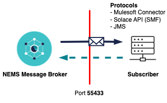
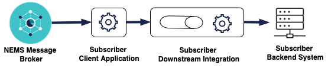

---
title: "Guidelines for Subscribers"
---

# National Event Management Service (NEMS) Guidelines for Subscribers

## Purpose
This document provides guidelines and recommendations for designing and developing National Event Management Service (NEMS) subscriber applications. It also has key information to invite and facilitate design considerations during the subscriber application design and development processes.  
## Audience
The target audience is primarily solution designers and application developers in organisations within the New Zealand health sector who are designing and developing solutions consuming national significant healthcare events from NEMS.
## Pre-reading**
The information of the NEMS key concepts, such as Event Driven Architecture, Event, and topic taxonomy, is provided in the NEMS Key Concepts document (--Reference link here--).

Understanding these concepts will form a good basis for designing your integration application as a NEMS subscriber.
## Design guidelines and considerations**
As a NEMS subscriber, your integration with NEMS will enable you to receive event messages from NEMS.

NEMS is a cloud-based service that supports the event-driven architecture in the New Zealand health sector. It is a public service and is securely exposed to internet. It adheres and mandates a set of standards [link]

NEMS supports various protocols, programming languages and integration technologies for subscribers for integration with NEMS, e.g. Java, .net and MuleSoft are supported with reference implementations.

### Event message and data

Event messages contain event data in their header and json based message payloads. You extract the data for further processing or integration with your systems.

### Subscriber queue
Typically, NEMS constructs one queue for each subscriber. Messages are routed to the subscriber’s queue according to the subscriptions. If a subscriber subscribes to different event types, messages of the subscribed event types (topics) will be routed to the same queue. The subscriber application needs to ensure there is logic that differentiates the events to process with appropriate downstream integrations.
### Event delivery
NEMS guarantees delivery of messages and the order of the messages. This means a message will remain on your queue until you receive and **acknowledge** you received the message with “**ACCEPTED**” acknowledgement. 

Once NEMS gets the acknowledgement, the message will be removed from the queue. In this way, NEMS guarantees the messages are well delivered.

NEMS is not supporting distributed transactions (XA) and will not propagating transaction context with current setup. You need to design your message acknowledgement settlement to deal with different scenarios of your message processing and downstream integrations.

We explain the acknowledgement and settlement further in the ‘Downstream integration’ section.
### Topics and event filtering
When designing your subscriber client application, it is important you understand the topic taxonomy for the event you are subscribing to. The topic taxonomy is documented in the event documentation section. Each event type has different topic taxonomy. It is documented in the event type catalogue.

As a subscriber, you can have specific event filtering based on the topic taxonomy for each event type. NEMS doesn’t support payload-based filtering since it does not unpack the payload in its data transfer. The filtering is configured and managed for you based on your eligibility and relevance. As part of the onboarding process, you can request a specific topic configuration to filter messages that are relevant for your organisation.

The NEMS topic taxonomy supports effective filtering capabilities, however there are instances where the event is of national significance, and it is difficult to target subscribers directly. It is important the subscriber understands the use cases when an event will be sent to them. If there is the possibility that an irrelevant event is sent to a subscriber, it is important the subscriber manages that event appropriately. They must discard any event not applicable to them to ensure compliance with privacy protections and data security.

### Connectivity patterns
NEMS exposes asynchronous APIs for subscribers following AsyncAPI specifications. If you are new to event-driven architecture, it is important you understand the difference between a typical synchronous API which you are probably familiar with, and an asynchronous event-driven API.

To receive messages / events in real-time, we recommend that you, as a subscriber, establish a secure Transmission Control Protocol (TCP) connection with the NEMS broker. If the subscriber is not connected, the NEMS broker can store the messages in the dedicated queue waiting for the subscriber to connect and consume. Once connection is established, the stored messages will be delivered and can be processed for your downstream integrations.

The NEMS platform supports a wide range of event-driven protocols. These protocols are exposed on non-standard ports. Therefore, as a subscriber you need to understand the security implications of connecting to a service that may require firewall changes to your enterprise. The diagram below represents the data flows for a subscriber.

*Subscriber Data Flow:*

We recommend and assume that you deploy your subscriber application behind a firewall. The firewall port needs to be open for outbound traffic, e.g. the subscriber client application must be able to reach the NEMS broker on port 55433. Messages are delivered through this connection. This applies to all the available NEMS environments you connect to, including the NEMS test and production environments.

|**Source**|**Target**|**Port**|**Comments**|
| :- | :- | :- | :- |
|nems.services.health.nz|Subscriber production|55443|JMS, SMF protocols|
|nems-test.services.health.nz|Subscriber non-production|55443|JMS, SMF protocols|
NEMS is configured for maximum availability. It is deployed in a high-availability configuration with a disaster recovery in a remote data centre. Maintenance can occur on the brokers from time-to-time. Maintenance procedures will be applied in a rolling fashion. It is important that subscribers implement retry functionality if they don’t want to be disconnected during maintenance procedures. Given the connection mandates OAuth 2.0, the client application should reconnect when a node is switched. This should happen instantaneously, however during a disaster the outage could be prolonged as there are some manual steps put in place to confirm that the switch of data centres is justified. Availability will adhere to the service level agreement of the platform.
### Subscription patterns

NEMS can support multiple subscription patterns, however, the default pattern subscribers should adopt is the publish/subscribe pattern. NEMS enhances the publish/subscribe model by guaranteeing the delivery of messages to a subscriber. In traditional publisher/subscriber pattern, subscribers must be connected to the topic at the time a message was published, otherwise they will not receive it. NEMS uses the concept of a topic, but to guarantee the delivery of that message, queues can subscribe to topics. The subscriber then connects to a dedicated queue guaranteeing delivery.

In the diagram above, subscribers receive different events from a dedicated queue. Filtering and subscriptions are managed by NEMS based on the subscriber’s requirements and approval. Guaranteed delivery of messages ensures events are available if the subscriber application is disconnected voluntarily or involuntarily. It also enables the ability to replay messages in the event of a disaster. You could use this feature to have intermittent subscription connection if the timeliness of the messages is less critical to you. With this pattern, you will consume and process the events in a batch style, which could reduce the computing cost of your subscribing application or could support your specific use cases.

### Direct messaging

If guaranteed delivery is not important, a subscriber can configure their client application to use direct messaging. This subscription pattern can be used if you require high throughput with dynamic data sets, e.g. current waiting list time. It is not critical to have a history of the waitlist as the next event will update the status.

### Downstream integrations

When building your downstream integrations, it is important that you implement logic that will be supported by your backend systems. As a subscriber you don’t have control of the frequency an event can be published. There could be scenarios where the event velocity spikes, putting pressure on the downstream integration. When designing your downstream integrations, you need to address three problem statements:

- Make sure the integration code can scale to meet the volume of events.
- Downstream applications need to be protected by the possibility of receiving large volumes of events.
- Separate event processing logic with downstream integration logic.

This can be achieved by segregating your integration flow into different bounded context as described in the diagram below.

The subscriber client application should contain minimal logic. The recommendation is that it only reads from the NEMS broker and places it on some persistent store, like a locally managed queue. Putting complex validation routines in this part of the program could cause unintended consequences, e.g. velocity of messages is too great for backend systems causing mass failure. The subscriber may have to engage with the NEMS support team to resolve the issue. This could cause extended delays in processing that event, and in the worst-case scenario messages may be lost.  

If possible, a microservice implementation is recommended to separate logic receiving of the event, from the downstream business logic. It also provides the flexibility to scale independently of each other. The downstream logic may need to be throttled to ensure the backend systems don’t get overwhelmed. 

### Acknowledgement settlements

NEMS is a service to support event-driven architecture. When receiving messages from NEMS it is important your client application acknowledges the NEMS broker appropriately to ensure there is no loss of data or service. NEMS has three types of acknowledgement settlements:

- **Accepted:** Sends an acknowledgement (ACK) back to NEMS informing the broker that the message was received successfully. NEMS will remove the message from the queue. 
- **Rejected:** Sends an acknowledgment (ACK) back to NEMS informing the broker that the message was received successfully but was rejected due to the event not being relevant to the subscriber. NEMS will remove the message from the queue.

  You should consider using **REJECTED** as a negative acknowledgement for** a message if the message received is not valid or can’t be processed. A rejected message will be removed from your queue.

- **Failed:** Sends a negative acknowledgement (NACK) back to NEMS informing the broker that the subscriber could not process the message successfully. NEMS will not remove the message from the queue so the subscriber can replay the message.

  You should consider using **FAILED** as a negative acknowledgement for** a message if the message processing encountered a failure in your processing and you want to receive it again and reprocess the message. The ‘failed’ message will remain in front of the queue – make sure you take the necessary action so you don’t end up with an infinite loop when you “FAIL” a message.

If the client application cannot or does not acknowledge an event, NEMS does not remove the message from the queue, and updates its status as being delivered. This means that when the subscriber application receives the message for the second time, it has a redelivery count greater than one.

When designing your subscriber application, it’s important to understand the implications of what happens when no acknowledgement is made. 

The diagram above shows a potential scenario where a message is received by the downstream integration, but something fails in the subscriber client application trying to acknowledge receipt of the message. The message will remain on the NEMS broker. When the message is sent again it will be a duplicate for the subscriber as it was successfully processed by the downstream integration process.

### Onboarding

When a subscriber is onboarded to NEMS, it could be for an event for which data is already being received via other legacy mechanisms. The subscriber can also be onboarded to an event that has been live well before the subscriber has been onboarded. NEMS supports the ability to replay events for subscribers that join late. Event are replayed in the same order that they would have if the subscriber was connected at the beginning.

As a subscriber a decision needs to be made how you would like to receive the data. If the requirement is to retrieve historical events the subscriber application needs to manage the potential duplicates or cutover from your legacy integration.

Historical messages will be delivered as one batch load. Depending on the volume of historical messages this could cause pressure on the downstream system, therefore precautions need to be put in place to ensure large traffic volumes are managed.

### Security and privacy

As a subscriber you could receive sensitive information that needs to be managed for the purpose intended. NEMS will work with the publishers to try and mitigate any privacy breaches. In some cases, it will not be possible to mitigate situations where a subscriber will receive an event that is not intended for them, e.g. NHI number does not exist in subscriber’s backend system. It is important subscribers understand this situation and implement logic to discard any event that is not intended for them.

NEMS ensures the data security and privacy protection when message/data transfers through NEMS. NEMS does not examine or validate the message, and all messages are encrypted in transfer.

NEMS allows only authenticated secure connections from the subscriber applications. Network-wise, you can only connect to NEMS with TCPS as a subscriber.

NEMS mandates the OAuth 2.0 client credential flow to secure its event-driven APIs (for both publishers and subscribers). This requires the use of a client ID and secret to acquire an authorisation token. It is important all credentials are managed and protected for all environments. This link provides guidance on how to manage secrets for your environment. https://cheatsheetseries.owasp.org/cheatsheets/Secrets_Management_Cheat_Sheet.html

Some of your use cases may require the subscriber application to call back to the source system to retrieve additional information about the event. These events may have been designed as a thin message (i.e. containing only resource identity) to protect privacy across the wire. If a message is intercepted maliciously, minimal data is contained in the message. The hacker would need the credentials to retrieve the full payload. As a subscriber, if the message is a thin event with a linked data source, you will also need to be granted access to the publisher's source API.  

We recommend you ask your NEMS support person to work with your security team if you need security assistance.

### Data retention

As a subscriber, data retention should only be used for what the event is intended for. It is possible that a subscriber receives an event that is not intended for them. In this situation, the subscriber should ACK the messages to the NEMS broker to indicate the event has been successfully received. As part of the internal processing, it should be discarded with no additional processing performed on the message. 

When a publisher sends a message to NEMS, they will provide header properties that allow developers to understand the content of the event without actually opening the payload. It is recommended headers are used by subscribers to determine whether the event should be discarded or not. Refer to the event documentation to understand the header configuration to implement this logic.

You should also pay attention to the logging and tracing of your subscribing application to ensure your compliance of security and privacy protection. 

### Monitoring and alerting

The nature of Event Driven Architecture means that the NEMS responsibility ends with the event message delivery. This will meet the availability and scalability requirements. As a subscriber, you are responsible to monitor your connection to NEMS, the message processing, and your downstream integrations according to your business needs and Service Level Agreements (SLAs). When designing your subscriber client application, it is important that monitoring and alerting are taken into consideration of your overall integration architecture.

It’s also important that effective logging is in place to help issue analysis and diagnostics. The event header supplies an event ID and a source. These fields can be used to trace the message back to the original publisher. NEMS also provides a header property Replication Group ID.

### Error handling
Error management in Event Driven Architecture requires some thorough design to address what to do when an event occurs. As all the processing occurs in the background, it is the subscriber client application that makes the decision what to do when an event occurs. This is different to GUI (Graphical User Interface) applications where errors can be presented to a screen and the user manages the error.

As discussed in the ‘Downstream integrations’ section, the recommendation is to separate the receiving of the event with the process of the event, using a microservice approach. This architecture also becomes helpful when managing errors. Whether you adopt a microservice approach or not, the logic to receive an event should not fail due to a business fault. The first part of the subscriber application should be to place it on persistent storage. That way the only real possibility of the receiving process failing is if the persistent storage is down. In this scenario NEMS manages the fault for the subscriber. The event will remain on the NEMS broker until the subscriber ACKs the message.

Managing downstream errors will differ for each subscriber and every event due to the required business logic to load the data into their backend systems. Regardless of the business logic required, you may want to think about the following use cases when designing a subscriber client application:

- invalid/malformed messages
- business faults
- system faults.

The publisher is committed to publishing valid formatted messages. Their error routines should stop any messages from being published if they are invalid, but this cannot be guaranteed. Therefore, when deciding how to manage an invalid message, the subscriber needs to decide whether they want to notify the publisher of the fault or just discard the message. If the decision is to notify the publisher, how does that information get captured so the error can be walked through?

Business faults are the most complex in nature as they can occur for any number of reasons. In most situations, business faults will need to be analysed. Therefore, when managing business faults do you pause processing until that message has been processed, or do you continue and move the event to the side so the issue can be managed out of process? Implementing event-driven principles can provide the tooling to achieve the desired outcomes easily.

System faults are generally black and white. Something in the process is down so cannot complete the task. If that service was available, the process would be completed successfully. System faults can affect every event, therefore continuing processing when a system fault occurs will only expedite the issue. The recommendation for system errors is to stop processing to limit the potential cleanup that could occur. If possible, implement an automated backoff process that will automatically resolve the issue without human intervention. In this scenario, there is no need to move the event from the persistent store, it can sit there waiting for the system fault to be resolved. 
### Disaster recovery and event replay
As a subscriber, the disaster recovery process should be considered according to your Recovery Time Objective (RTO) and Recovery Point Objective (RPO), with a view to recovering your system integrated with NEMS. An example could be that a downstream application failed and needs to be restored from backup.

NEMS supports your recovery by being able to replay event messages with original order. 

If the decision is made to implement a robust process to allow the replay of messages, it is important to understand that NEMS will replay the events in the same order they were originally processed. The message replay could be based on the following criteria:

- From the beginning (caveat. is that replay logs get purged over time so will only replay what has not been purged).
- From a point in time.
- From a Replication Group Id.

Implementing a mechanism to trace what events have been processed or received could be a simple reduced risk solution that can meet your needs for a disaster recovery. In the event of a disaster, you can refer to the traces to identify the last message received before the disaster happened. The subscriber can then request a replay from that moment. If the trace also records the Replication Group Id, that can be used as the starting point for the replay. 

You could choose to replay message systematically via the NEMS API and build it into your application; or you could make the replay message a manual process as part of your operation. NEMS provides the capability and flexibility to design your Disaster Recovery (DR) process and ensure the business continuity.

NEMS guarantees no loss of data in the event of its own disaster, which means the RPO of NEMS is ZERO. If NEMS experiences a catastrophic event, all connections to the broker will be lost. The NEMS team will evaluate the situation and make a quick decision to switch to the secondary site or resolve the issue in place. From a subscriber perspective, no changes need to be made to the client application. Once the service has been restored, processing will continue. Refer to the ‘Acknowledgement’ section to understand how to manage events that could have been processed to backend systems but failed to send a successful ACK back to NEMS.
### Testing

NEMS recommends subscribers consider at least two types of tests before releasing to production:

1. Test with NEMS test environment.
2. Test with mocked events.

The NEMS test environment will produce simulated messages on a regular interval so subscribers can perform their end-to-end testing. It is important to note that the publishing system may not have the data or test scenarios to support a complete end-to-end test where data is received from NEMS and loaded into the subscriber's backend system. E.g. the identity in the message might not support your callback process to retrieve additional data in your integration.

NEMS also provides the ability to have mock events which allow subscribers to implement system tests to ensure the downstream integration logic is fit for production. You could use the mock events to for different purposes. E.g

- Process invalid/malformed events.
- Run stress/load/performance tests.
- Business logic assertion.

NEMS provides simple test units that replicate a NEMS message. As a subscriber you can use these examples to build your test scenarios, e.g. message volume, or error management. These test units can be used without being onboarded to the NEMS platform. It is recommended the system testing is completed to satisfaction before progressing to end-to-end testing.
## Contact information
[Contact info here?]
