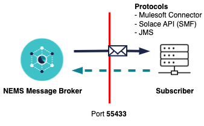
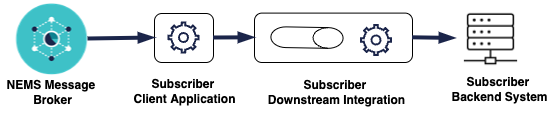

---
title: "Guidelines for Subscribers"
---

# National Event Management Service (NEMS) Guidelines for Subscribers

## Purpose

This document provides guidance and recommendations for the design and development of National Event Management Service (NEMS) subscriber applications. It includes key information to support decision-making and promote effective design considerations throughout the subscriber application design, development, and implementation lifecycle.

## Audience

The target audience is primarily solution designers and application developers in organisations within the New Zealand health sector who are designing and developing solutions consuming national significant healthcare events from NEMS.

## Pre-reading

The information of the NEMS key concepts, such as Event Driven Architecture, event, and topic taxonomy, is provided in the [NEMS Key Concepts document](/docs/Guidelines/).

Understanding these concepts will form a good basis for designing your integration application as a NEMS subscriber.

## Design guidelines and considerations

As a NEMS subscriber, your integration with NEMS will enable you to receive event messages from NEMS.

NEMS is a cloud-based service that supports the event-driven architecture in the New Zealand health sector. It is a public service and is securely exposed to internet. It adheres and mandates a set of [standards](/docs/100-PubSub%20Standards.md).

NEMS supports various protocols, programming languages and integration technologies for subscribers for integration with NEMS, e.g. Java, .net and MuleSoft are supported with reference implementations.

### Event message and data

NEMS events notify subscribers that a business event has occurred. Depending on the event design, the message may contain either a minimal set of information (thin event) or a more complete representation of the business data (thick event).
For thin events, subscribers are expected to retrieve additional information from the publisher through the APIs or interfaces specified in the event definition. For thick events, the required business data may be included directly within the event payload.

Subscribers should always refer to the event specification to understand:

- The business meaning of the event.
- The event payload structure and format.
Mandatory and optional fields.
- Any callback or data retrieval requirements.

NEMS provides reliable event transport but does not validate the business content of messages. Subscribers are responsible for validating incoming events and ensuring the data meets their business and technical requirements before processing.

Subscribers should also include the following considerations when design their solutions:

- Duplicate events.
- Out-of-order event delivery.
- Temporary failures when retrieving additional data.
- Changes introduced through event versioning.

### Subscriber queue

NEMS typically provisions a dedicated queue for each subscriber. Messages are routed to the subscriber's queue based on the configured topic subscriptions. Where a subscriber consumes multiple event types, events from all subscribed topics will be delivered to the same queue.

Subscriber applications are therefore responsible for identifying and processing each event appropriately. This may involve routing events to different business processes, downstream systems, or handlers based on the event type, topic, or message metadata.

Subscribers should design their solutions to support the processing of multiple event types from a single queue while maintaining clear separation of business logic for each event they consume.

### Event delivery

NEMS provides guaranteed message delivery and message ordering for events delivered to a subscriber queue. A message remains on the queue until it has been successfully processed and acknowledged by the subscriber using an ACCEPTED settlement outcome.

Once NEMS receives the ACCEPTED acknowledgement, the message is removed from the queue and will not be delivered again. This acknowledgement mechanism ensures that messages are not lost if a subscriber application becomes unavailable or encounters processing errors.

NEMS does not support distributed transactions (XA) and does not propagate transaction context between systems. As a result, subscribers are responsible for determining when a message should be acknowledged based on their own processing requirements and downstream integration patterns.
Subscribers should carefully design their acknowledgement and settlement strategy to account for scenarios such as:

- Successful message processing.
- Temporary failures in downstream systems.
- Message validation errors.
- Retry and recovery requirements.
- Duplicate message handling.

In general, a message should only be acknowledged once the subscriber has completed the processing required to meet its business and operational requirements. This helps ensure that events are not lost if failures occur during downstream processing.

Further guidance on acknowledgement and settlement patterns is provided in the Downstream Integration section.

### Topics and event filtering
When designing a subscriber application, it is important to understand the topic taxonomy associated with the event types being consumed. The topic taxonomy defines how events are categorised and routed within NEMS and is documented in the relevant event specification and Event catalogue. Each event type may have a different topic structure and filtering model.

NEMS uses topic-based filtering to control which events are delivered to subscribers. Filtering is performed using the topic taxonomy rather than the event payload, as NEMS does not inspect or process payload content during message routing. 

Subscription filters are configured and managed as part of the subscriber onboarding process, based on business need, eligibility, and authorised access to the data.

During onboarding, subscribers can request topic subscriptions that align with their business requirements, ensuring they receive only the event categories relevant to their organisation.
While the NEMS topic taxonomy provides powerful filtering capabilities, some events are of broad or national significance and cannot always be precisely targeted to individual organisations. As a result, subscribers may occasionally receive events that are not relevant to their specific business processes.

Subscribers are responsible for understanding the circumstances under which events are delivered and for implementing appropriate business rules to determine whether an event should be processed. Any event that is not relevant or authorised for use by the subscriber should be promptly discarded and must not be retained, processed, or disclosed beyond what is necessary to determine its applicability.

Proper handling of irrelevant events is essential to maintaining compliance with privacy, security, and information governance requirements, and helps ensure that health information is only used for authorised purposes.

### Connectivity patterns

NEMS exposes asynchronous APIs for subscribers following AsyncAPI specifications. If you are new to event-driven architecture, it is important you understand the difference between a typical synchronous API which you are probably familiar with, and an asynchronous event-driven API.

To receive messages / events in real-time, we recommend that you, as a subscriber, establish a secure Transmission Control Protocol (TCP) connection with the NEMS broker. If the subscriber is not connected, the NEMS broker can store the messages in the dedicated queue waiting for the subscriber to connect and consume. Once connection is established, the stored messages will be delivered and can be processed for your downstream integrations.

The NEMS platform supports a wide range of event-driven protocols. These protocols are exposed on non-standard ports. Therefore, as a subscriber you need to understand the security implications of connecting to a service that may require firewall changes to your enterprise. The diagram below represents the data flows for a subscriber.

*Subscriber Data Flow:*

We recommend and assume that you deploy your subscriber application behind a firewall. The firewall port needs to be open for outbound traffic, e.g. the subscriber client application must be able to reach the NEMS broker on specific port. Messages are delivered through this connection. This applies to all the available NEMS environments you connect to, including the NEMS test and production environments.

NEMS is configured for maximum availability. It is deployed in a high-availability configuration with a disaster recovery in a remote data centre. Maintenance can occur on the brokers from time-to-time. Maintenance procedures will be applied in a rolling fashion. It is important that subscribers implement retry functionality if they don’t want to be disconnected during maintenance procedures. Given the connection mandates OAuth 2.0, the client application should reconnect when a node is switched. This should happen instantaneously, however during a disaster the outage could be prolonged as there are some manual steps put in place to confirm that the switch of data centres is justified. Availability will adhere to the service level agreement of the platform.

### Subscription patterns

NEMS supports several messaging patterns; however, the recommended approach for subscribers is the publish/subscribe model. NEMS extends the traditional publish/subscribe pattern by providing guaranteed message delivery, ensuring that events are not lost if a subscriber is temporarily unavailable.

In a traditional publish/subscribe implementation, a subscriber must be actively connected to the topic when an event is published. If the subscriber is disconnected, the event will typically be missed. NEMS addresses this limitation by introducing durable queues that subscribe to topics on behalf of subscribers. Events published to a topic are stored on the subscriber's dedicated queue until they are successfully consumed and acknowledged.

Subscribers connect to their dedicated queue rather than directly to the topic, enabling reliable event delivery and supporting temporary outages, maintenance activities, and application restarts.

In the example above, a subscriber receives events from a dedicated queue that may contain messages from one or more subscribed event types. Topic subscriptions and filtering rules are configured and managed by NEMS based on approved business requirements and access permissions.
Guaranteed delivery provides several benefits:

- Events remain available while the subscriber application is offline.
- Messages are protected from temporary connectivity or application failures.
- Historical messages can be replayed when required for recovery or disaster scenarios.
- Subscribers can consume events at their own pace without risking message loss.

This architecture also supports use cases where real-time processing is not required. For example, a subscriber may choose to connect periodically and process accumulated events in batches. This approach can reduce infrastructure and operational costs while still ensuring that all relevant events are received and processed reliably.

### Direct messaging

If guaranteed delivery is not important, a subscriber can configure their client application to use direct messaging. This subscription pattern can be used if you require high throughput with dynamic data sets, e.g. current waiting list time. It is not critical to have a history of the wait list as the next event will update the status.

### Downstream integrations

When designing downstream integrations, it is important to ensure that both the subscriber application and the systems it integrates with can support the expected event workload. As a subscriber, you do not control when or how frequently events are published. Event volumes may occasionally increase significantly, creating pressure on downstream processing and backend systems.

Subscriber solutions should be designed to address three key challenges:

- **Scalability** – Ensure the event processing components can scale to handle varying event volumes and spikes in demand.
- **Protection of downstream systems** – Prevent backend applications from being overwhelmed by bursts of incoming events.
- **Separation of concerns** – Decouple event consumption and processing from downstream integration logic to improve resilience, maintainability, and recovery capabilities.

A recommended approach is to separate the solution into distinct processing layers or bounded contexts. By isolating event ingestion, event processing, and downstream integration responsibilities, subscribers can scale each component independently, protect critical backend systems, and better manage failures without impacting the overall event consumption capability.
This architecture also enables buffering, throttling, retry handling, and workload management patterns to be introduced between components, helping ensure that downstream systems continue to operate reliably even during periods of elevated event activity.

The diagram below illustrates a recommended integration pattern for separating event consumption from downstream processing and application integration:

The subscriber client should be kept as lightweight as possible. Its primary responsibility should be to consume events from NEMS and persist them to a durable store, such as an internal queue, event log, or messaging platform for downstream processing.

Complex validation, transformation, and business processing should be avoided within the event consumption layer. Introducing significant processing logic at this point can reduce throughput and increase the risk of backlogs forming during periods of high event volume. In extreme cases, messages may accumulate faster than they can be processed, impacting subscriber performance and delaying the delivery of events to downstream systems.

It is recommended that event ingestion be separated from business processing. A common approach is to implement a microservice architecture where one service is responsible for consuming and storing events, while separate services perform validation, transformation, enrichment, and downstream integration. This separation improves resilience, simplifies troubleshooting, and allows each component to be scaled independently according to its workload.

Decoupling event consumption from downstream processing also enables subscribers to introduce buffering, retry mechanisms, and throttling controls. These capabilities help protect backend systems from sudden spikes in event volume and ensure that downstream applications can process events at a rate they can sustainably support.

By keeping the subscriber client lightweight and separating responsibilities across bounded contexts, organisations can improve scalability, minimise operational risk, and maintain reliable event processing even during periods of increased demand.

### Acknowledgement settlements
NEMS supports reliable event-driven integration through an acknowledgement and settlement model. Selecting the appropriate settlement outcome is critical to ensuring messages are processed correctly and not lost or unnecessarily replayed.

NEMS supports three settlement outcomes:

#### ACCEPTED
The message has been successfully processed and no further action is required.

When a subscriber sends an **ACCEPTED** settlement, NEMS removes the message from the subscriber queue and it will not be delivered again.

#### REJECTED
The message was received successfully but should not be processed.

This outcome is typically used when:

- The event is not relevant to the subscriber.
- The message is invalid.
- Business rules prevent the message from being processed.
- Retrying the message will not resolve the issue.

When a message is **REJECTED**, NEMS removes it from the subscriber queue.

#### FAILED
The message could not be processed due to a temporary or recoverable error.

This outcome is typically used when:

- A downstream system is unavailable.
- A network or connectivity issue occurs.
- Processing encounters a transient error.
- Retrying the message may result in successful processing.

When a message is **FAILED**, NEMS retains it on the queue and makes it available for redelivery.

>**Important**: Messages that are repeatedly marked as **FAILED** may create a processing loop if the underlying issue is not resolved. Subscribers should implement appropriate monitoring, alerting, and recovery procedures.

#### Unacknowledged Messages
If a subscriber does not settle a message, NEMS retains the message on the queue and marks it as delivered. The message will be redelivered and its delivery count will increase.

Subscribers should therefore design their solutions to tolerate duplicate message delivery.

For example, a downstream business process may complete successfully, but the subscriber application may fail before sending an acknowledgement back to NEMS. Since NEMS has not received confirmation that processing completed, the message will be delivered again. From the subscriber's perspective, this results in a duplicate event.

To minimise this risk, subscribers should:

- Implement idempotent processing.
- Carefully determine when messages should be settled.
- Acknowledge messages only after the required business processing has completed successfully.

As a general principle, a message should only be **ACCEPTED** when the subscriber is confident that it does not need to be processed again.

### Onboarding

Once a subscriber has been approved to onboard to NEMS, they may begin consuming events they currently receive through a legacy integration. 

The subscriber can choose either to: 

- receive events from an agreed point in time; or 

- receive historical events generated before their NEMS connection was established. 

Where historical events are required, NEMS can replay them in the same sequence in which they were originally published. 

The subscriber application must be able to identify and manage duplicate messages. Duplicates may occur where the same information has already been received through the legacy integration and is then replayed through NEMS. 

Historical events are delivered as a single batch. Depending on the number of messages, the batch may create a significant increase in traffic and place additional load on the subscriber’s downstream systems. Appropriate controls must therefore be in place to manage the increased volume and reduce the risk of performance degradation or service disruption. 

### Security and privacy
As a subscriber, you may receive sensitive health information that must only be used for its intended and authorised purpose. While NEMS and event publishers work together to minimise privacy risks through event design, topic filtering, and access controls, there may be situations where a subscriber receives an event that is not relevant to their organisation.

For example, a subscriber may receive an event for an individual who does not exist in its local system or is otherwise outside its scope of responsibility. Subscribers must be prepared for these scenarios and implement appropriate business rules to identify and securely discard any event that is not applicable to them.

NEMS provides secure transport of events between publishers and subscribers. All communications with NEMS are encrypted in transit, and NEMS does not inspect, process, or validate the business content of event payloads. This design protects privacy while ensuring events can be transferred efficiently and securely.

Subscriber applications can connect to NEMS only through authenticated and encrypted connections. NEMS supports secure TCPS connectivity and requires all subscriber applications to be explicitly authorised before access is granted.

NEMS uses the OAuth 2.0 Client Credentials grant to secure event publishing and consumption. Subscriber applications must use approved client credentials to obtain access tokens before connecting to NEMS. Organisations are responsible for securely managing and protecting these credentials across all environments, including development, test, and production.

Credential management should follow established security practices, such as secure secret storage, controlled access, credential rotation, and audit monitoring. The OWASP Secrets Management Cheat Sheet provides useful guidance for protecting application secrets and credentials:
[Secrets Management Cheat Sheet](https://cheatsheetseries.owasp.org/cheatsheets/Secrets_Management_Cheat_Sheet.html)

Some event types are intentionally designed as thin events, containing only the minimum information required to identify an event. Additional information can be obtained by calling a publisher-provided API or data service. This approach reduces the amount of sensitive information transmitted within event messages and limits the impact of any potential interception.

Where callback or data retrieval APIs are used, subscribers must obtain the necessary authorisation from the publisher and comply with the publisher's security requirements. Access to NEMS does not automatically grant access to publisher-managed APIs or source systems.

Subscribers should engage their organisational security teams and the NEMS team early in the onboarding process to ensure security, privacy, identity, and access management requirements are fully understood and implemented.

### Data retention

As a subscriber, any retained data should be used only for the purpose intended by the event. In some cases, you may receive an event that is not relevant to your system or business process. When this occurs, the message should still be acknowledged (ACKed) to the NEMS broker to confirm successful receipt. The event should then be discarded as part of your internal processing, with no further handling or use of the message content.

When a publisher sends an event to NEMS, it includes message header properties that provide key information about the event without requiring the payload to be inspected. Subscribers should use these headers, where possible, to determine whether an event is relevant and should be processed or discarded. Refer to the event documentation for details of the available header properties and the recommended filtering logic.

Subscribers should also ensure that logging, monitoring, and tracing practices comply with applicable security, privacy, and data protection requirements. Care should be taken to prevent sensitive information from being unnecessarily captured or retained in application logs and diagnostic data.

### Monitoring and alerting
The nature of Event Driven Architecture means that NEMS is responsible for the reliable delivery of event messages, after which responsibility transfers to the subscriber. This separation of responsibilities enables NEMS to meet its availability, scalability, and performance objectives. As a subscriber, you are responsible for monitoring your connectivity to NEMS, the health of your message processing components, and any downstream integrations required to meet your business requirements and Service Level Agreements (SLAs). Monitoring, alerting, and operational support should be considered key aspects of your overall integration architecture.

Effective logging and tracing are also essential for operational support, troubleshooting, and auditability. Event messages include header properties such as the Event ID and Source, which can be used to track a message throughout its lifecycle and identify the originating publisher. NEMS also provides a Replication Group Message ID, which can assist with message tracing, correlation, and diagnostic investigations. These identifiers should be captured in application logs and monitoring tools to support efficient issue analysis and resolution.

### Error handling

Error management is a critical aspect of Event Driven Architecture and requires careful design. Because event processing occurs asynchronously and without direct user interaction, the subscriber application is responsible for determining how errors are handled when they occur. This differs from traditional graphical user interface (GUI) applications, where errors can be presented to users for immediate resolution.

As discussed in the Downstream Integrations section, a recommended approach is to separate event ingestion from business processing, typically through a microservice-based architecture. This pattern not only improves scalability and resilience but also simplifies error handling. Regardless of the architecture adopted, the event consumption component should be designed to avoid failures caused by business processing issues. Its primary responsibility should be to receive the event and persist it to reliable storage. This ensures that business processing can occur independently and that message receipt remains resilient. In this model, the most significant failure scenario is the loss of the persistent storage service. If this occurs, NEMS will continue to retain the message until it is successfully acknowledged (ACKed) by the subscriber.

The management of downstream processing errors will vary depending on the subscriber’s business requirements and the systems involved. However, when designing a subscriber solution, it is important to consider how the following categories of errors will be handled:
- Invalid or malformed messages
- Business faults
- System faults

#### Invalid or Malformed Messages
Publishers are expected to validate messages before they are published to NEMS. While this significantly reduces the likelihood of invalid events being distributed, subscribers should not assume that all received messages are valid. Subscriber solutions should include processes to detect malformed or invalid messages and define an appropriate handling strategy. This may involve discarding the message, quarantining it for analysis, or notifying the publisher so corrective action can be taken. Consider how such faults will be identified, recorded, and tracked to support investigation and resolution.

#### Business Faults
Business faults occur when an event is technically valid but cannot be processed because of business rules or data conditions within the subscriber’s environment. These faults are often the most complex to manage and typically require investigation or manual intervention. Subscriber solutions should determine whether processing should pause until the issue is resolved or whether the affected event should be isolated and moved to a separate workflow while other events continue to be processed. Event-driven architectures provide flexibility to implement patterns such as dead-letter queues, exception queues, or compensation processes to support these scenarios.

#### System Faults
System faults occur when a required component or dependency is unavailable, preventing successful processing of the event. Examples include database outages, network failures, or unavailable downstream services. Unlike business faults, system faults typically affect all events and are unlikely to be resolved through repeated immediate retries. In these circumstances, the recommended approach is to temporarily suspend processing to prevent the accumulation of additional failures and reduce recovery effort. Where possible, automated retry and backoff mechanisms should be implemented to allow recovery without manual intervention. Events can remain safely stored in the persistent processing layer until the underlying issue has been resolved and normal processing can resume.

By designing clear strategies for invalid messages, business faults, and system faults, subscribers can improve the reliability, resilience, and maintainability of their event-driven integrations while ensuring that events are processed consistently and recoverably.

### Disaster Recovery and Event Replay

As a subscriber, your Disaster Recovery (DR) strategy should be designed to meet your Recovery Time Objective (RTO) and Recovery Point Objective (RPO), with a focus on restoring the systems and integrations that consume events from NEMS. For example, a downstream application may experience a failure and require restoration from backup before normal event processing can resume.

NEMS supports subscriber recovery through its message replay capability, allowing event messages to be replayed in their original publication order. This capability can be used to recover missed or unprocessed events following a system outage or disaster.

If you choose to incorporate message replay into your disaster recovery processes, it is important to understand that replayed events are delivered in the same sequence as they were originally published. Replay requests can be initiated using one of the following starting points:

- From the beginning of the available replay log (subject to replay log retention policies).
- From a specified point in time.
- From a specific Replication Group Message ID.

A simple and effective recovery approach is to maintain traceability of processed or received events. By recording key identifiers, such as the Event ID and Replication Group Message ID, subscribers can determine the last successfully processed event before an outage occurred. Following recovery, a replay can be requested from the appropriate point, reducing the risk of data loss and simplifying reconciliation activities.

Replay functionality can be incorporated directly into subscriber applications through automated processes, or managed as an operational procedure triggered when required. NEMS provides the flexibility to support a range of disaster recovery approaches, enabling subscribers to implement a solution that aligns with their business continuity requirements.

NEMS is designed to provide resilient event delivery and ensures that no event data is lost in the event of a NEMS platform failure. As a result, the NEMS platform has an RPO of zero. If NEMS experiences a major service disruption, subscriber connections to the broker will be interrupted. The NEMS operations team will assess the situation and either restore service or fail over to the secondary environment as appropriate.

From a subscriber perspective, no application changes are required during a NEMS failover event. Once connectivity is restored, event processing can resume automatically. However, subscribers should ensure their applications can handle scenarios where an event has been successfully processed by a downstream system but the acknowledgement (ACK) was not successfully returned to NEMS. Refer to the Acknowledgement section for guidance on designing idempotent processing and managing potential message redelivery following recovery events.

### Testing

NEMS recommends that subscribers perform testing at multiple levels before deploying solutions to production. At a minimum, subscribers should complete:

1. End-to-end testing using the NEMS test environment.
1. System and integration testing using mock events.

The NEMS test environment can generate simulated event messages at regular intervals, enabling subscribers to validate connectivity, message consumption, and end-to-end integration flows. However, subscribers should be aware that publishing systems in test environments may not always contain the data, scenarios, or supporting records required for comprehensive business testing. For example, identifiers contained within an event may not support downstream processes that retrieve additional information from external systems.

To complement end-to-end testing, NEMS provides mock event examples that allow subscribers to validate their application logic independently of the NEMS platform. These mock events can be used to verify that subscriber solutions are production-ready and can correctly handle a range of operational and business scenarios.

Typical uses for mock events include:

- Validating the handling of invalid or malformed messages.
- Testing error management and recovery processes.
- Verifying business rule processing and expected outcomes.
- Performing stress, load, and performance testing.
- Confirming message ordering and processing behaviour under different volumes.

NEMS provides sample test messages that replicate the structure and format of production events. Subscribers can use these examples to develop automated test suites, simulate message volumes, and validate resilience and error-handling capabilities. These test assets can be used before onboarding to the NEMS platform, allowing development and system testing to begin early in the delivery lifecycle.

It is recommended that system and integration testing using mock events is completed successfully before progressing to end-to-end testing within the NEMS environment. This approach helps identify and resolve issues earlier, reduces onboarding risk, and provides greater confidence that the subscriber solution will operate reliably in production.

### Traceability and Audit

To satisfy the end to end traceability requirements, the subscribers must record the event information upon receiving and discarding event messages. A subscriber must 
- record the `messageId`, `messageSubjectId` and `timestamp` in the logs (or traces) if messageSubjectId is NOT NHI
- record the `messageId` and `timestamp` in the logs (or traces) if messageSubjectId is NHI
